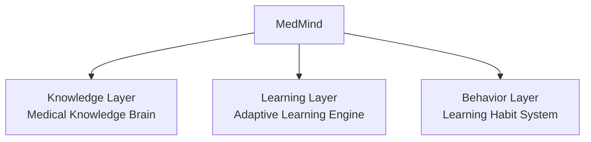
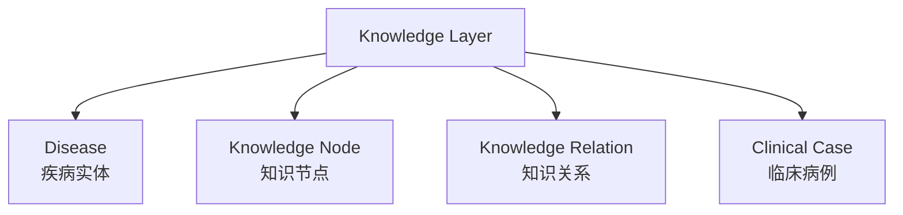
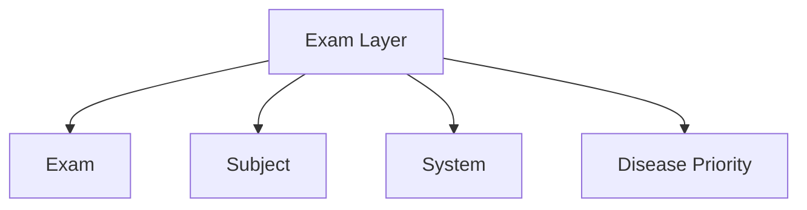
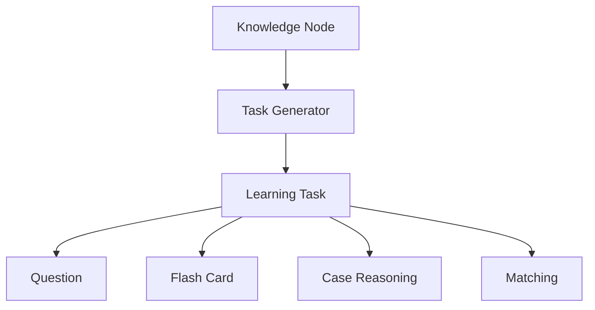
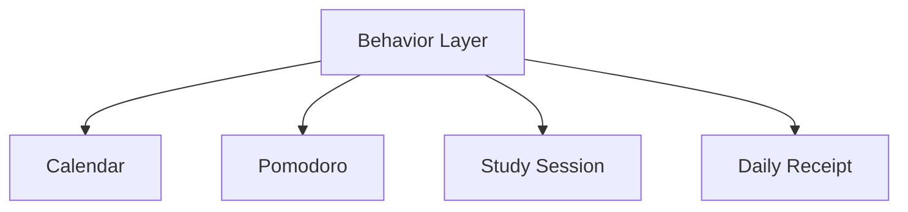
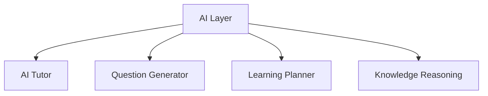
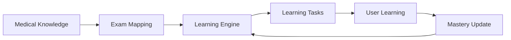

# MedMind Product Architecture

## Overview

MedMind is an AI-powered medical learning system designed for medical students preparing for medical examinations.

MedMind is not only a question bank. It integrates:

- Medical knowledge organization
- Exam-oriented learning
- Adaptive learning engine
- Learning behavior tracking


---

# High Level Architecture




---

# 1. Knowledge Layer

## Purpose

The Knowledge Layer organizes medical knowledge into structured learning units.

It answers:

> What should students learn?




## Components

### Disease

Represents a medical disease.

Examples:

- COPD
- Asthma
- Heart Failure
- Gastric Ulcer


---

### Knowledge Node

The smallest medical learning unit.

Examples:

- FEV1/FVC < 70%
- Smoking is the major risk factor of COPD
- ACEI can cause cough


Each knowledge node contains:

- Medical concept
- Explanation
- Related knowledge
- Learning format


---

### Knowledge Relation

Connects medical concepts.

Example:

```
Smoking

↓

Chronic inflammation

↓

Airflow limitation
```


---

# 2. Exam Layer

## Purpose

Medical knowledge and exam priorities are separated.

The same medical knowledge can support different examinations.





Example:

```
Exam:

306 Western Medicine Comprehensive


Subject:

Internal Medicine


System:

Respiratory


Disease:

COPD


Priority:

High
```


---

# 3. Learning Layer

## Purpose

The Learning Layer converts medical knowledge into interactive learning tasks.





## Learning Task Types


### Choice

Example:

```
Which finding supports COPD diagnosis?
```


### Matching

Example:

```
Disease

↓

Characteristic finding
```


### Sorting

Example:

```
Arrange pathogenesis process
```


### Case Reasoning

Example:

```
Patient presentation

↓

Diagnosis

↓

Treatment
```


---

# 4. Behavior Layer

## Purpose

Track user learning behavior and improve learning motivation.





---

## Calendar

Functions:

- Exam countdown
- Study schedule
- Daily learning overview


Example:

```
306 Exam Countdown

487 Days Remaining


2026-08-05

Medical Science

120 min

English

60 min
```


---

## Pomodoro

Purpose:

Record effective learning time.


Example:

```
COPD Diagnosis

50 minutes

Completed
```


---

## Daily Receipt

A shopping-receipt-style daily learning summary.


Example:

```
====================

        MedMind

     DAILY RECEIPT


Date:

2026-08-05


--------------------

COPD Mechanism

50 min


COPD Diagnosis

25 min


Error Review

25 min


--------------------

Total:

100 min


XP:

+120


====================
```


---

# 5. AI Layer (Future)

The AI Layer provides intelligent assistance.





---

# 6. Data Flow





---

# 7. Repository Structure


```
MedMind

├── frontend

├── backend

├── knowledge

├── exam

├── learning-engine

├── database

├── user-system
│
│   ├── calendar
│
│   ├── pomodoro
│
│   └── receipt

├── docs
│
│   ├── PRODUCT_ARCHITECTURE.md
│
│   ├── KNOWLEDGE_SCHEMA.md
│
│   └── ROADMAP.md

└── README.md
```


---

# Version

Current Version:

v0.3

Date:

2026-08-05
