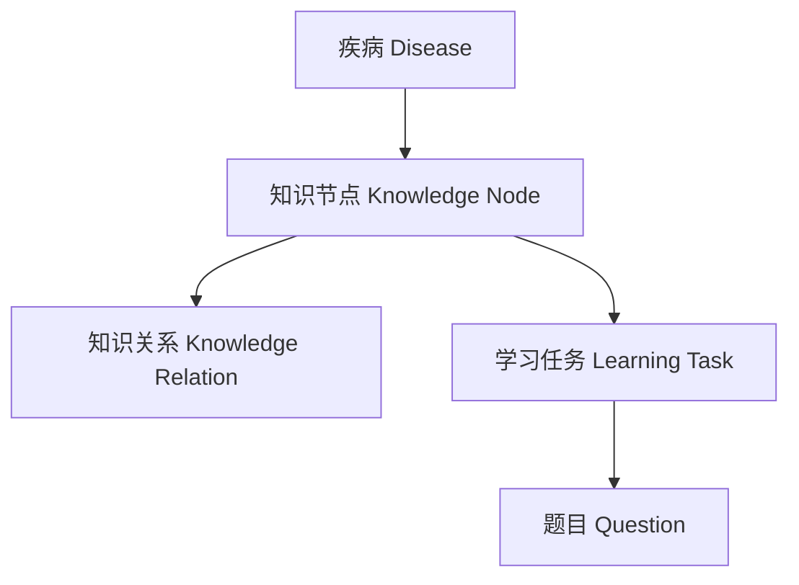

# MedMind 医学知识数据结构设计

## Knowledge Schema v0.3

版本：

v0.3

日期：

2026-08-05


---

# 1. 设计目标


MedMind 是一个面向医学考试的智能学习系统。

本知识结构设计的目标：

不是建立一个医学百科数据库。

而是将医学知识拆解为：

```
医学知识

↓

结构化知识节点

↓

学习任务

↓

个性化学习体验
```


---

# 2. 核心设计原则


## 原则1：医学知识与考试体系分离


医学知识本身不携带考试分值。


例如：


医学知识：

```
FEV1/FVC < 70%
```

属于：

```
COPD诊断标准
```


考试映射：

```
306西医综合

呼吸系统

高频考点
```


学习任务：

```
选择题：

COPD诊断依据是什么？
```


三者分别属于：

```
Knowledge Layer

Exam Layer

Learning Layer
```


---

## 原则2：知识节点最小化


一个 Knowledge Node 应该表示一个可以独立学习的医学概念。


例如：

正确：

```
吸烟是COPD最重要危险因素
```


错误：

```
COPD所有危险因素、机制、诊断、治疗
```

全部放在一个节点。


---

## 原则3：一个知识支持多种学习形式


同一个知识节点可以生成：

- 选择题
- 匹配题
- 填空题
- 闪卡
- 病例推理


---

# 3. 数据关系模型





---

# 4. Disease（疾病实体）


## 定义


Disease 是医学知识的一级分类。


例如：

```
慢性阻塞性肺疾病

COPD
```


数据结构：

```json
{
"disease_id":"",
"name_cn":"",
"name_en":"",
"system":"",
"description":"",
"knowledge_nodes":[]
}
```


字段说明：


|字段|说明|
|-|-|
|disease_id|疾病唯一编号|
|name_cn|中文名称|
|name_en|英文名称|
|system|所属医学系统|
|description|疾病简介|
|knowledge_nodes|关联知识节点|


示例：


```json
{
"disease_id":"RESP_COPD",

"name_cn":"慢性阻塞性肺疾病",

"name_en":"Chronic Obstructive Pulmonary Disease",

"system":"呼吸系统",

"description":"一种以持续气流受限为特征的慢性气道疾病",

"knowledge_nodes":[]
}
```


---

# 5. Knowledge Node（知识节点）


## 定义


Knowledge Node 是 MedMind 最核心的数据单位。


一个知识节点代表一个：

> 可以被学习、测试和复习的医学概念。


结构：

```json
{
"knowledge_id":"",
"type":"",
"title":"",
"content":"",
"related_nodes":[],
"learning_formats":[]
}
```


字段说明：


|字段|说明|
|-|-|
|knowledge_id|知识唯一编号|
|type|知识类型|
|title|知识标题|
|content|知识内容|
|related_nodes|关联知识|
|learning_formats|适合学习方式|


---

# 6. Knowledge Type（知识类型）


## 基础医学知识


```
definition
定义

etiology
病因

epidemiology
流行病学

pathogenesis
发病机制

pathology
病理
```


---

## 临床医学知识


```
symptom
症状

sign
体征

laboratory
实验室检查

imaging
影像学检查

diagnosis
诊断

differential
鉴别诊断

treatment
治疗

complication
并发症

prognosis
预后
```


---

## 学习辅助知识


```
trap
易错点

mnemonic
记忆方法

comparison
疾病比较

clinical_reasoning
临床推理
```


---

# 7. Knowledge Node 示例


```json
{
"knowledge_id":"COPD_DIAG_001",

"type":"diagnosis",

"title":"持续气流受限",

"content":"FEV1/FVC<70%提示持续气流受限",

"related_nodes":[
"COPD_PATH_001"
],

"learning_formats":[
"choice",
"flashcard",
"case_reasoning"
]
}
```


---

# 8. Knowledge Relation（知识关系）


## 定义


描述医学知识之间的联系。


例如：

```
吸烟

↓

导致

慢性气道炎症

↓

导致

气流受限
```


数据结构：


```json
{
"source":"",
"relation":"",
"target":""
}
```


关系类型：


```
causes
导致


leads_to
发展为


associated_with
相关


diagnostic_of
提示诊断


treated_by
治疗方式


differentiates_from
鉴别
```


---

# 9. Learning Format（学习形式）


知识节点支持的训练方式：


```
choice

选择题


matching

匹配题


sorting

排序题


fill_blank

填空题


flashcard

闪卡


case_reasoning

病例推理
```


---

# 10. Clinical Case（临床病例）


## 定义


将临床场景转换为推理训练。


结构：


```json
{
"case_id":"",
"title":"",
"presentation":"",
"diagnosis":"",
"related_nodes":[]
}
```


示例：


```json
{
"case_id":"COPD_CASE_001",

"title":"长期吸烟患者出现活动后气促",

"presentation":"男性，长期吸烟，慢性咳嗽，肺功能异常",

"diagnosis":"COPD",

"related_nodes":[
"COPD_DIAG_001"
]
}
```


---

# 11. 文件组织结构


```
knowledge

├── diseases

│
├── respiratory

│   ├── COPD.json

│   └── Asthma.json


├── cardiovascular

│   └── HeartFailure.json


└── digestive

    └── GastricUlcer.json
```


---

# 12. 后续扩展


未来可以增加：

```
source_reference
知识来源


ai_explanation
AI解释


difficulty
学习难度


user_mastery
用户掌握度
```


---

# 总结


MedMind知识体系：

```
疾病

↓

知识节点

↓

知识关系

↓

学习任务

↓

用户掌握
```


医学知识负责：

“学什么”


考试体系负责：

“考什么”


学习系统负责：

“怎么学”


---

MedMind Knowledge Schema v0.3
